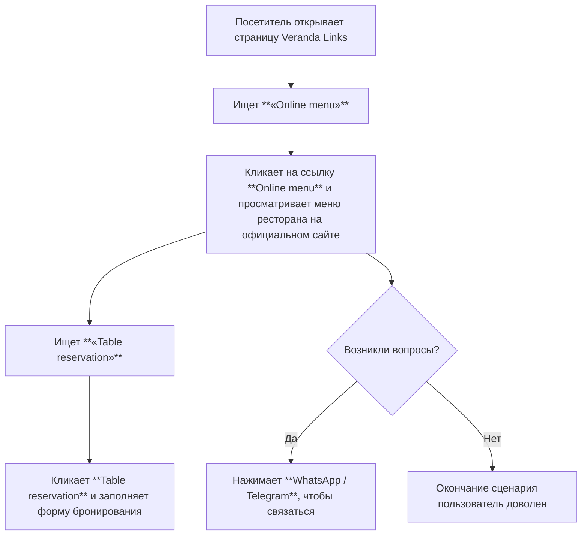

# Исполнительное резюме

Страница **veranda.my/links** содержит основные навигационные ссылки ресторана «Veranda» (меню, бронирование, контакты, соцсети). В текущем виде она минималистична, но страдает от слабой визуальной иерархии и неочевидных сигналов кликабельности. Это усложняет задачу пользователям быстро найти нужное (меню, бронирование, контакты и т.д.). Мы предлагаем переработать оформление, сохранив существующий контент, но улучшив типографику, контраст, размещение элементов и микро-копирайт. Предложения включают: чёткие заголовки разделов, более описательные надписи ссылок (информационный аромат), достаточные отступы и акценты для ссылок, явные состояния фокуса и большие зоны нажатия【39†L32-L34】【17†L31-L39】. Также рекомендуется приоритизировать наиболее важную информацию (меню и бронирование) вверху страницы【30†L147-L150】. Ожидаемые выгоды – лучшее обнаружение ссылок, уменьшение ошибок при нажатии и улучшенная доступность для пользователей с особыми потребностями. Ниже приведён анализ текущей страницы и конкретные предложения с обоснованием, планом внедрения, приоритетом и оценкой влияния на доступность.

## Содержимое страницы (текущий)

Согласно коду страницы, видимые элементы и ссылки на veranda.my/links:

- **Veranda** – заголовок (логотип или название сайта).  
- **Quick links** – текстовый раздел (быстрые ссылки).  
- **Рабочие часы:** *Mon–Thu 10:00–22:00; Fri–Sun 10:00–23:00* (информация о часах работы).  
- **Переключатель языка:** `RU`, `EN`, `VI`, `KO` (4 ссылки-переключателя языка)【6†L16-L17】.  
- **Раздел «Service»**:  
  - *Online menu Website* – ссылка на сайт с меню【6†L20-L21】.  
  - *Table reservation Website* – ссылка на сайт бронирования стола【6†L20-L21】.  
  - *Google Maps Directions* – ссылка на карту проезда (maps.app.goo.gl)【6†L20-L21】.  
- **Раздел «Contacts & social»**:  
  - *Telegram group @gamezone_vietnam* – ссылка Telegram-группы【6†L25-L27】.  
  - *We are on Telegram @veranda.my* – ссылка на канал или чат Telegram【6†L25-L27】.  
  - *We are on WhatsApp +84 396 314 266* – ссылка WhatsApp для связи【6†L25-L27】.  
  - *Contact director @zapleo_ceo* – ссылка на директора в Telegram【6†L25-L27】.  
  - *Facebook Veranda* – ссылка на страницу Facebook【6†L25-L27】.  
- **Footer:** © 2026 Veranda.  

Все перечисленные элементы взяты с сайта【6†L20-L27】. Их текст и заголовки даны “как есть” на странице.

## Оценка текущего интерфейса

- **Визуальная иерархия и типографика:** Страница плоская – единственный явно оформленный заголовок (H1) – «Veranda»【6†L6-L7】. Разделы «Service» и «Contacts & social» выделены как H2【6†L18-L23】, а «Quick links» и «Working hours» остаются простым текстом (не заголовками). Это снижает ясность структуры. Шрифты и размеры неизвестны, но текст, вероятно, стандартный без акцентов. Как правило, рекомендуется минимум 16 px для удобочитаемости текста【39†L32-L34】, но стоит проверить фактический размер.  
- **Отступы и групировка:** Все элементы размещены вертикально компактно и выровнены по центру. Разделы неочевидно разграничены, мало пробельных отступов. Улучшенная белая зона между блоками (например, работа – язык – сервис – контакты) помогла бы сканированию.  
- **Цвет и контраст:** При стандартном оформлении (тёмный текст по светлому фону) контраст хороший (больше 21:1 чёрного и белого【21†L99-L107】). Важно проверить, чтобы ссылки (например, «Online menu» и другие) выделялись цветом/подчёркиванием и имели также контраст ≥ 4.5:1【21†L99-L107】 при текущем фоновом цвете. Если ссылки используют серый цвет (#777 – 4.47:1), их надо затемнить【21†L99-L107】【20†L13-L21】.  
- **Сигналы кликабельности (аффордансы):** Ссылки оформлены просто как текст (судя по выводу). На скриншоте NN/g показано, как важно явно обозначать кликабельные области – например, цветом или подчёркиванием【28†L61-L69】. Если список «Quick links» стилизован нейтрально, пользователь может не распознать, что «Online menu» – это ссылка. В идеале ссылки должны выделяться (например, цветом/подчёркиванием) и иметь «эффект наведения». Также следует проверить, что при фокусе у ссылок есть видимый контур – согласно WCAG 2.4.7, индикатор фокуса должен быть отчётлив【11†L0-L3】【28†L61-L69】.  
- **Доступность (WCAG):** С точки зрения клавиатуры, все элементы – это ссылки, их порядок должен быть логичным (хочется начать с переключения языка или с «Service»?). Надписи «RU», «EN» и т.п. сами по себе могут быть непонятны для скрин-ридера; лучше добавить `aria-label` (например, «Русский язык») или текстовую метку. По критерию WCAG 2.4.4 текст ссылок должен ясно описывать цель【8†L1-L4】【10†L151-L158】; фразы «We are on Telegram» добавляют лишних слов. Лучше использовать лаконичные тексты. Зоны нажатия ссылок (особенно для мобильных) должны быть не меньше 24×24 CSSpx【17†L31-L39】 (рекомендуется ~44×44 px или 7–10 мм как на Android)【17†L31-L39】【13†L0-L3】. Если пункты меню слишком близко, их надо увеличить за счёт паддингов и межстрочного расстояния.  
- **Мобильная отзывчивость:** Ширина контента, по-видимому, адаптивная (вероятно, единичный столбец). Главное – проверить, что при узком экране не появляется горизонтальная прокрутка【30†L162-L168】 и текст остаётся читабельным (wcag рекомендация: минимум 16px шрифт, что мы уже упомянули【39†L32-L34】). Разметку можно сделать «резиновой»: например, два столбца (Service и Contacts) на десктопе, один столбец на мобильном. Важно обеспечить порядок: сначала вывести самое важное (меню и бронирование) в верх страницы【30†L147-L150】, чтобы на смартфонах не пришлось много скроллить.  
- **Производительность:** Страница лёгкая: минимум текста, нет больших медиа. Для производительности важно минимизировать и кэшировать ресурсы. По лучшим практикам, нужно минимизировать CSS/JS (они, видимо, тут почти отсутствуют) и включить сжатие контента【36†L218-L224】. Использование HTTP/2 и CDN улучшит доставку【36†L218-L224】. Если на страницу грузятся иконки социальных сетей (SVG/шрифты), убедиться, что они оптимизированы (подходящий формат и включён `font-display: swap` для шрифтов)【36†L218-L224】. В текущем виде задержка загрузки, скорее всего, минимальна.  
- **Информационный аромат (смысловая насыщенность меток):** Пользователи ищут конкретные функции: меню, бронирование, контакт. Ссылки должны сигнализировать об этом. Критерий WCAG (Link Purpose) подчёркивает, что текст ссылок должен быть точным【10†L151-L158】. На странице «Online menu Website» чуть избыточно (слово «Website» можно убрать). Наличие слова «Online» годится. «Table reservation» понятен, но «Website» опять лишнее. В «Contacts & social» фразы «We are on…» не добавляют ценности. Лучше использовать названия сервисов (например, «Telegram: @veranda.my») или «WhatsApp: +84…» без вводных слов. Это повысит вероятность клика по нужной ссылке, так как пользователи сразу увидят знакомые ключевые слова (Telegram, WhatsApp, Facebook)【10†L151-L158】. 

Таким образом, текущая страница работоспособна, но имеет ряд UX-проблем: слабая структуризация, неоптимальная микро-копия, малые зоны нажатия и недостаточные сигналы кликабельности. Ниже приведены конкретные рекомендации по улучшению.

## Предложения по обновлению UI/UX

1. **Выделить заголовок «Quick links» и «Working hours»:**  
   - *Описание изменения:* Оформить эти надписи как заголовки (например, превратить «Quick links» в `<h2>Quick Links</h2>`, «Working hours» – в `<h3>` или `
<strong>Working hours</strong>`).  
   - *Обоснование:* Чёткая семантика заголовков улучшает читабельность и сканируемость интерфейса. Исследования показывают, что пользователи быстро воспринимают структуру по заголовкам【30†L147-L150】.  
   - *Польза:* Пользователь мгновенно увидит, что «Quick links» – это отдельный раздел. Аналогично «Working hours» будет явно отделён и проще воспринимаем.  
   - *Реализация:* В HTML/CSS – добавить теги заголовков (h2/h3) или хотя бы стилизовать текст «Quick links» жирным большим шрифтом.  
   - *Приоритет:* **Высокий**. Улучшит структуру сразу.  
   - *Доступность:* Грамотная разметка заголовков помогает навигации скрин-ридеров (WCAG 2.4.6 – заголовки).  

2. **Увеличить минимальный размер шрифта до 16px:**  
   - *Описание:* Убедиться, что основной текст (особенно меню ссылок) не меньше 16 пикселей.  
   - *Обоснование:* Рекомендуется минимальный размер шрифта 16px для удобочитаемости【39†L32-L34】. Меньший размер делает текст трудночитаемым для многих пользователей, особенно пожилых.  
   - *Польза:* Улучшится восприятие текста, увеличится вероятность прочтения информации. Людям с ослабленным зрением будет легче.  
   - *Реализация:* В CSS установить `font-size: 16px` (или эквивалент em/rem) для основного текста, проверив отсутствие жестко зафиксированных меньших размеров.  
   - *Приоритет:* **Высокий**. Существенно влияет на читаемость.  
   - *Доступность:* В соответствии с исследованиями, более крупные шрифты повышают понимание текста【39†L32-L34】; это соответствует WCAG по обычному тексту (2.0) и облегчает доступность.

3. **Улучшить оформление ссылок (цвет, подчёркивание) для явной кликабельности:**  
   - *Описание:* Задать для ссылок заметный цвет и/или подчёркивание (например, брендовый акцентный цвет или стандартный синий), и убедиться в явном изменении при наведении/фокусе.  
   - *Обоснование:* Согласно NN/g, интерактивные элементы должны иметь чёткие визуальные сигналы【28†L61-L69】 (цвет, рамка, тень). Без них пользователи «метаются» по тексту, тратят лишние клики.  
   - *Польза:* Пользователь сразу увидит, какие элементы можно нажать. Это снизит вероятность клика по неактивным областям и ускорит навигацию.  
   - *Реализация:* В CSS для `a` установить отличие цвета от основного текста (например, `color: #005ea0;` для нормального состояния и `color: #003f7f;` для hover). Добавить `text-decoration: underline` или `border-bottom` для подчеркивания. Убедиться, что ссылки не окрашены в цвет фона.  
   - *Приоритет:* **Высокий**. Одно из ключевых улучшений юзабилити.  
   - *Доступность:* Такое оформление помогает пользователям с дальтонизмом и другим нарушениям зрения заметить ссылки (не полагаться только на цвет)【28†L138-L147】【21†L99-L107】.  

4. **Добавить фокусные состояния для ссылок:**  
   - *Описание:* Обеспечить явное визуальное выделение (outline или подсветка) при фокусе на клавиатуре.  
   - *Обоснование:* WCAG 2.4.7 требует видимый индикатор фокуса【11†L0-L3】. Без него люди, которые перемещаются по клавиатуре или используют экранную лупу, могут потеряться.  
   - *Польза:* Пользователь будет точно знать, на каком элементе он сейчас находится при навигации клавиатурой, что особенно важно для слабовидящих.  
   - *Реализация:* В CSS добавить `:focus { outline: 2px solid #005ea0; outline-offset: 2px; }` или другой видимый стиль. Проверить, что существующие стили (если есть) не сбрасывают outline (некоторые фреймворки его убирают).  
   - *Приоритет:* **Средний**. Обычно настраиваемый outline делают по завершении основного дизайна.  
   - *Доступность:* Полностью соответствует WCAG SC 2.4.7 «Focus Visible»【11†L0-L3】.

5. **Расширить зоны нажатия ссылок (отступы и интерлинейка):**  
   - *Описание:* Увеличить вертикальные и горизонтальные отступы вокруг ссылок, особенно в мобильной верстке.  
   - *Обоснование:* Согласно WCAG 2.5.8, интерактивная область должна быть не меньше 24×24 CSS пикселей【17†L31-L39】 (лучше 44×44 px для удобства)【17†L31-L39】. Узкие кликабельные текстовые ссылки ухудшают UX на сенсорных экранах.  
   - *Польза:* Пользователи смогут точнее нажимать на нужную ссылку, избегая ошибок. Особенно важно для людей с тремором рук и на маленьких экранах.  
   - *Реализация:* В CSS добавить, например, `padding: 10px 0; display: inline-block;` для `<a>` в списках, чтобы увеличить кликабельную область по вертикали. Увеличить межстрочный интервал (`line-height`) для читаемости.  
   - *Приоритет:* **Высокий**. Улучшает удобство для мобильных и маломобильных пользователей.  
   - *Доступность:* Соответствует WCAG SC 2.5.8; увеличенные области помогают пользователям с моторными затруднениями【17†L31-L39】.

6. **Обновить тексты ссылок для лучшего информационного аромата:**  
   - *Описание:* Переформулировать микро-копию ссылок, убрать лишние слова, добавить контекст. Например:  
     - *Online menu* (вместо «Online menu Website»)  
     - *Reserve table* (вместо «Table reservation Website»)  
     - *Telegram (Veranda community)* для двух ссылок в Telegram (указать, какой это чат или канал).  
     - *WhatsApp: +84 396 314 266* (вместо «We are on WhatsApp +84…»)  
     - *Director (Telegram: @zapleo_ceo)* (указать канал связи и имя)  
     - *Facebook: Veranda* (вместо «Facebook Veranda»)  
   - *Обоснование:* По WCAG название ссылки должно ясно описывать её цель【10†L151-L158】. Избыточные фразы вроде «We are on» сбивают с толку и снижают «аромат» ссылки. Чёткие ключевые слова («WhatsApp», «Telegram», «Facebook», «Reserve table») значительно повышают узнаваемость цели ссылки【10†L151-L158】.  
   - *Польза:* Пользователь мгновенно поймёт, куда ведёт ссылка (например, «WhatsApp: +84…» явно пригласит написать сообщение). Это ускорит поиск нужной информации.  
   - *Реализация:* Поменять текст внутри тега `<a>` на более описательный. Напр., `<a href="...">Reserve a table</a>` вместо «Table reservation Website». Проверить размеры контейнеров на адекватность.  
   - *Приоритет:* **Высокий**. Улучшает эффективность навигации и удовлетворённость пользователей.  
   - *Доступность:* Ясные метки ссылок помогают всем пользователям, особенно с когнитивными нарушениями, быстро сориентироваться【10†L151-L158】.

7. **Группировать языковой переключатель более информативно:**  
   - *Описание:* Вместо сокращений `RU`, `EN`, `VI`, `KO` можно писать полные названия языков (русский, English, Tiếng Việt, 한국어) или добавить пояснение «Language:».  
   - *Обоснование:* Аббревиатуры могут быть неочевидны (например, `VI` для русского пользователя неочевидно как «вьетнамский»). Чёткая метка улучшит восприятие.  
   - *Польза:* Пользователи сразу поймут, какой язык они выбрали и какие варианты доступны.  
   - *Реализация:* Изменить текст ссылок: «РУС» или «Русский» вместо «RU», «EN» на «English» и т.д. Либо поместить их под общим заголовком «Language:». Это чисто HTML/текстовое изменение, без новых ресурсов.  
   - *Приоритет:* **Средний**. Немного улучшает UX, но не критично.  
   - *Доступность:* Полная надпись удобнее для пользователей скрин-ридеров (озвучат «Русский», а не «RU»).  

8. **Реорганизовать таблицу контактов (Contacts & social):**  
   - *Описание:* Перечислить контакты более структурированно: например, сгруппировать Telegram-каналы вместе, отвести мессенджеры в список. Добавить ролевые метки (явный признак «WhatsApp» и т.д.).  
   - *Обоснование:* Сейчас две ссылки с Telegram выглядят одинаково («group» и «are on Telegram»). Чёткое разделение и подписи повысит ясность. Согласно информационному аромату, лучше разбить на «Telegram (Group): @gamezone_vietnam» и «Telegram (Veranda): @veranda.my».  
   - *Польза:* Пользователь сразу увидит, что существуют два разных Telegram-канала (группа и официальный), и не перепутает их. Аналогично, «WhatsApp: номер» и «Director (Telegram): @zapleo_ceo» будет сразу понятно.  
   - *Реализация:* В HTML – каждый пункт `<li>` переписать как предложено выше. Можно добавить списки подзаголовки (например, **Телеграм:** перед ссылками). Визуально сделать выравнивание или отступы, чтобы пункты «Contacts & social» выглядели аккуратнее.  
   - *Приоритет:* **Средний**. Улучшает удобство, но не критично ломает текущую логику.  
   - *Доступность:* Четкое группирование помогает навигации. Screen reader поймёт, о чём каждая ссылка.  

9. **Проверить и оптимизировать контрастные состояния наведения/активности:**  
   - *Описание:* Убедиться, что при наведении или активации (hover/focus/active) цвет ссылки меняется так, чтобы сохранялся минимум 4.5:1 контраст【21†L99-L107】.  
   - *Обоснование:* Иногда дизайнеры делают hover-линии слишком светлыми. Согласно WCAG, любые видимые состояния текстовых элементов должны иметь тот же минимальный контраст【19†L155-L163】【21†L99-L107】.  
   - *Польза:* Люди с нарушенным восприятием цвета или при ярком солнце смогут видеть изменения ссылки.  
   - *Реализация:* В CSS задать соответствующие цвета, проверить их с помощью контрастного анализатора (например, WebAIM Contrast Checker). При необходимости улучшить оттенки.  
   - *Приоритет:* **Низкий** (детальная шлифовка дизайна).  
   - *Доступность:* Предотвращает ситуации, когда например, контраст ссылки становится недостаточным при наведение【19†L155-L163】.

10. **Добавить метки aria или alt к неявным элементам (если применимо):**  
    - *Описание:* Если логотип «V» (стр. 4) – это изображение, дать ему `alt="Veranda"`; кнопкам соцсетей – aria-label.  
    - *Обоснование:* У пользователя со скрин-ридером должна быть понятна роль графических элементов. WCAG 1.1.1 требует альтернативного текста для всех важных изображений.  
    - *Польза:* Повысит доступность для пользователей с нарушениями зрения.  
    - *Реализация:* Проверить исходный HTML: если логотип – ``, добавить `alt`. Если используемые иконки – `<svg>` или шрифты, убедиться, что aria-метки есть.  
    - *Приоритет:* **Средний**. Если сейчас alt уже есть (например, просто текст «V»), можно уточнить.  
    - *Доступность:* Соответствует базовому требованию WCAG 1.1.1; необходима для корректного озвучивания.

11. **Оптимизировать загрузку ресурсов (при необходимости):**  
    - *Описание:* Минимизировать и сжать CSS/JS, использовать `rel="preload"`, кеширование.  
    - *Обоснование:* Для производительности следует минимизировать задержку рендеринга【36†L218-L224】. Хотя страница мала, общие практики не помешают.  
    - *Польза:* Ещё быстрее загрузка страницы (особенно при медленном интернете), лучше Core Web Vitals.  
    - *Реализация:* Настроить gzip/Brotli на сервере для CSS/HTML. Если есть внешние скрипты/шрифты, отложить их загрузку, включить `font-display: swap`.  
    - *Приоритет:* **Низкий**. Текущая страница и так минималистична; можно улучшать, но не критично для UX.  
    - *Доступность:* Не напрямую влияет на доступность, но быстрая загрузка полезна для всех.

12. **Мобильная адаптивность:**  
    - *Описание:* Убедиться, что макет корректно отображается на разных размерах экрана. Разбить блоки «Service» и «Contacts & social» на две колонки на большом экране и на одну – на маленьком. Обеспечить мета-тег `<meta name="viewport" content="width=device-width, initial-scale=1">`.  
    - *Обоснование:* Как отмечено, приоритет важной информации должен быть очевиден на мобильном【30†L147-L150】. Отсутствие горизонтальной прокрутки и читабельный текст – фундаментальные требования.  
    - *Польза:* Сайт будет одинаково удобен и на десктопе, и на смартфоне. Пользователь быстро найдет нужную ссылку без «зумирования» или свайпа вбок.  
    - *Реализация:* В CSS использовать медиазапросы, flexbox/grid. Проверить компоновку при ширине экрана от 320px и выше. Добавить `viewport` в `<head>` если его нет.  
    - *Приоритет:* **Высокий**. Большая часть пользователей может приходить с мобильных.  
    - *Доступность:* Избегает горизонтального скролла, как требует WCAG (причём на малых экранах это особенно важно)【30†L162-L168】.

13. **Поддержка клавиатурной навигации:**  
    - *Описание:* Убедиться, что все ссылки доступны по Tab, порядок логичен (например, языки – сервис – контакты). Добавить «skip link» (ссылку «Перейти к содержимому») – хотя на такой короткой странице это не обязательно.  
    - *Обоснование:* WCAG требует, чтобы все функции были доступны с клавиатуры【30†L162-L168】. Если есть интерактивные элементы, они должны идти в естественном порядке.  
    - *Польза:* Пользователи, которые не пользуются мышью (на клавиатуре или экранной клаве), смогут легко перейти от одного раздела к другому.  
    - *Реализация:* Проверить порядок элементов в DOM. Можно явно указать `tabindex` при необходимости (но лучше избегать ручной). Добавить skip-link если планируется большая страница.  
    - *Приоритет:* **Средний**. Не будет сразу заметно, но повышает общую доступность.  
    - *Доступность:* Соответствует SC 2.1.1: без мыши работать нельзя.

14. **Обновить подписи к разделам (микро-копирайт):**  
    - *Описание:* Возможно, изменить заголовки разделов: «Service» ➔ «Our services» или «Service» ➔ «Our services», «Contacts & social» ➔ «Contact & Social».  
    - *Обоснование:* Сделать разделы более человечными и понятными (человекочитаемыми).  
    - *Польза:* Улучшает восприятие интерфейса (например, «Our services» звучит дружелюбнее).  
    - *Реализация:* Изменить текст заголовка H2 в HTML.  
    - *Приоритет:* **Низкий**. Детали стилистики, не критично.  
    - *Доступность:* Ничего существенно не меняет, кроме удобочитаемости.

## Сравнительная таблица: текущее и предложенное оформление

| **Группа / раздел**      | **Текущий вид**                                    | **Предлагаемый вид**                             |
|--------------------------|----------------------------------------------------|--------------------------------------------------|
| **Переключатель языка**  | Короткие коды: «RU EN VI KO» (рядом, без пояснений)【6†L16-L17】 | Полные названия («Русский, English, Tiếng Việt, 한국어») или со знаком «🌐 Язык: Русский»; увеличенные кликабельные зоны.  |
| **Служебные ссылки (Service)** | Список текста (Online menu Website; Table reservation Website; Google Maps Directions)【6†L20-L21】. Без значков. | Каждый пункт – отдельный `<a>` с подчёркиванием/цветом. Текст сокращён: «Online menu», «Reserve table», «Directions (Google Maps)». Отступы между ними, можно иконки (метод CSS). |
| **Контакты и соцсети**    | Пункт-пункт в одну колонку: Telegram group, Telegram (veranda), WhatsApp, Director, Facebook【6†L25-L27】. Тексты «We are on…» запутывают. | Логичная группировка: например, списки с подзаголовком «Telegram», «Messaging», «Social». Переименовать: «Telegram (группа) @gamezone_vietnam», «Telegram (официальный) @veranda.my», «WhatsApp: +84…», «Директор (Telegram) @zapleo_ceo», «Facebook: Veranda». Цветовые метки или иконки могут помочь. |
| **Рабочие часы**         | Простым текстом «Mon–Thu 10:00–22:00, Fri–Sun 10:00–23:00»【6†L10-L14】. | Можно выделить отдельной секцией или карточкой с иконкой часов. Например, `
<strong>Working hours:</strong> Mon–Thu 10:00–22:00 Fri–Sun 10:00–23:00
`. |
| **Заголовки разделов**   | «Quick links» не оформлено, «Service» и «Contacts & social» – H2【6†L18-L23】. | Сделать «Quick links» `<h2>Quick links</h2>`, «Service» H2, «Contacts & social» H2. Может перевести на русский («Контакты и соцсети»). |

> **Примечание:** Таблица демонстрирует лишь концепцию изменений макета/компонентов. Каждый пункт следует реализовать через CSS/HTML, сохраняя исходный набор ссылок.

## Сценарий взаимодействия (структура действий пользователя)

Эта диаграмма показывает примерный путь: пользователь приходит на страницу со ссылками, находит меню, затем бронирует стол, при необходимости обращается в мессенджеры. Улучшения UI (отмечены выше) сделают каждый шаг более очевидным и быстрым.

### Ключевые выводы

- **Ясность меток:** Чёткий текст ссылок соответствует тезисам **информационного аромата** (WCAG 2.4.4) – пользователи сразу видят, куда ведёт ссылка【10†L151-L158】.  
- **Заметность ссылок:** Ссылки должны выглядеть как интерактивные элементы (NN/g)【28†L61-L69】, а области нажатия – быть большими (WCAG 2.5.8)【17†L31-L39】.  
- **Доступность:** Предложения включают стандарты WCAG по контрасту (не менее 4.5:1)【21†L99-L107】, видимому фокусу【11†L0-L3】, клавиатурной навигации【30†L162-L168】 и читабельности шрифта【39†L32-L34】.  
- **Мобильность:** Приоритетная информация (меню, бронирование) всегда вверху, без горизонтального скролла【30†L147-L150】【30†L162-L168】, крупный текст и кнопки.  
- **Реализация:** Все изменения можно воплотить в HTML/CSS без добавления новых страниц или графических активов. Например, CSS-правила для подчеркивания ссылок, изменения `padding`, и улучшенные тексты в `<a>` – простые шаги, но дают ощутимый эффект.  
- **Влияние:** Вышеописанные правки значительно улучшат UX: страницы станут понятнее, пользователи быстрее найдут нужный раздел, снизятся ошибки нажатий и число бессмысленных кликов. Для людей с особыми потребностями (слабовидящие, пожилые, с нарушениями моторики) эти улучшения критичны и подчиняются лучшим практикам доступности【28†L61-L69】【17†L31-L39】.

Направленная и структурированная переработка страницы **veranda.my/links** повысит её эффективность как навигационного узла ресторана Veranda. Основываясь на принципах WCAG и проверенных UX-паттернах, рекомендации выше делают интерфейс более интуитивным, инклюзивным и удобным для всех пользователей.